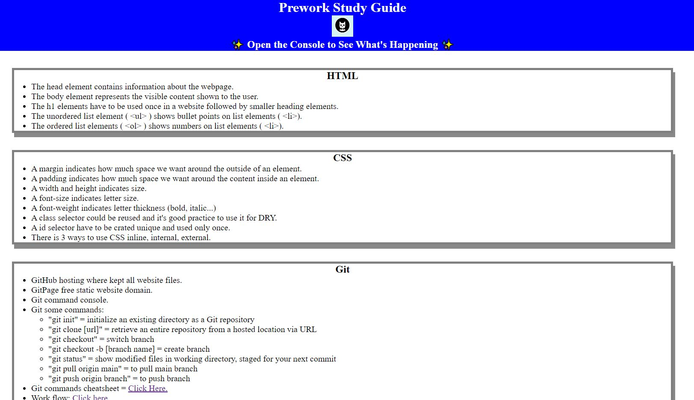

# README-Helper

## Description

README-helper project was created to help you write high-quality README file for your projects. This command line tool was build using Node.js and it's readme file was generated using tis application.

## Table of Contents 

* [Installation](#installation)

* [Usage](#usage)

* [License](#license)

* [Questions](#questions)

* [Tests](#Tests)

## Installation

To run tests, run the following commands:

npm install (you need to have node.js installed in your machine)

## Usage

You can use this application by running => node index.js

### Project image:

## Tests
To run tests, run the following command => npm test

## Questionsa

If you have any questions about the repo, open an issue or contact me directly at marius.kub@outlook.com.
You can find more of my work at [MarKub](https://github.com/MarKub/).

## License

[Eclipse Public License version 2.0](https://github.com/apache/iotdb/blob/master/licenses/Eclipse%20Public%20License%20version%202.0%20(EPL-2.0))